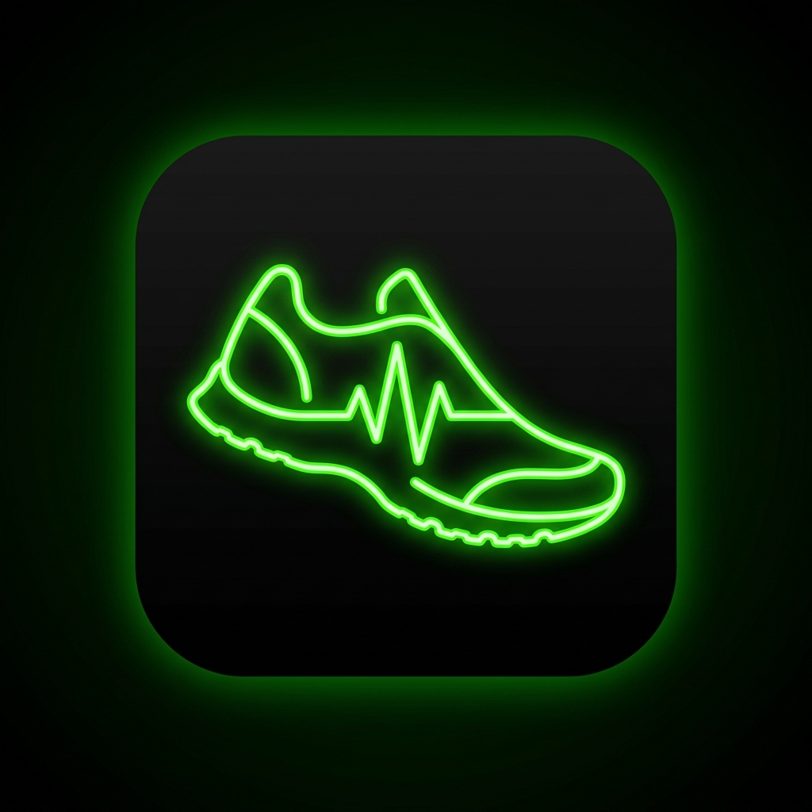

<div align="center">
  
  <h1>🏃‍♂️ My Fitness Tracker 🚴‍♀️</h1>
  <p><strong>A premium, mobile-first, and highly-performant Progressive Web App (PWA) for tracking your outdoor activities.</strong></p>

  <p>
    
    
    
    
  </p>
</div>

---

## ✨ Overview

**My Fitness Tracker** is built to rival industry leaders like Strava, offering a sleek **Neon Dark Mode** aesthetic powered by deep glassmorphism. It uses real-time Geolocation APIs combined with local device caching and InsForge to provide a seamless tracking experience.

## 📸 Sneak Peek

### The Dashboard
A centralized hub showing a live map preview and lifetime statistics. Focus on the custom glass panes and context-aware messaging.

<div align="center">
  
</div>

### The Tracking Experience
An ergonomic, bottom-heavy design built for active use. Features large interaction targets and high-contrast metrics superimposed over a live tracking map.

<div align="center">
  
</div>

---

## 🚀 Key Features

- **📍 Real-time Geolocation**: Immersive full-screen map experience using Leaflet.
- **📊 Live Metrics Dashboard**: Tracks Distance (Haversine formula), Duration, Speed/Pace, and calculated Calories burned based on MET values.
- **🎨 Strava-Style UI**: High visibility layout optimized for outdoor use, boasting a minimalist display that pops with custom neon animations.
- **📡 Robust Signal Handling**: Smart GPS timeouts and drop-out buffers ensure your data isn't lost during temporary signal loss.
- **☁️ Cloud Sync**: Instant and secure backend storage powered by the **InsForge** BaaS.
- **📱 PWA Ready**: Installable directly to your phone's home screen for a native app feel.

---

## 🛠️ Technology Stack

| Technology | Description |
|---|---|
| **Framework** | Next.js 15 (React 19) |
| **Styling** | Tailwind CSS v4 (with custom `@theme` variables) |
| **Mapping** | Leaflet + React-Leaflet |
| **Backend & DB** | InsForge SDK |
| **Icons** | Lucide React |
| **PWA** | `next-pwa` |

---

## ⚙️ Setup & Installation

Follow these steps to run the project locally.

### 1. Prerequisites
Ensure you have Node.js installed and an active [InsForge](https://insforge.com) project setup.

### 2. Clone & Install
```bash
git clone <repository_url>
cd myfitnesstracker
npm install
```

### 3. Environment Variables
Create a `.env.local` file in the root directory and add your InsForge credentials:
```env
NEXT_PUBLIC_INSFORGE_URL="your-project-url"
NEXT_PUBLIC_INSFORGE_ANON_KEY="your-anon-api-key"
```

### 4. Database Schema Requirements
You need an `activities` table in your InsForge database with the following columns:
- `id` (uuid, primary key)
- `user_id` (uuid, foreign key to auth.users)
- `type` (text: 'walk', 'run', 'bike')
- `distance` (numeric, in km)
- `duration` (numeric, in seconds)
- `calories` (numeric)
- `gps_path` (jsonb array)
- `date` (timestamp)

### 5. Run the Application
The `package.json` contains a specific workaround for Next.js caching logic with the PWA setup:

```bash
npm run dev
```

> **Note on Local Testing**: Browsers restrict Geolocation APIs on insecure (HTTP) origins unless on `localhost`. To test fully on a mobile device, you may need to use a tunneling service (like Localtunnel or Ngrok) to serve your local dev environment over HTTPS. Next.js configurations have been specifically tailored to allow this origin.

---

## 🗺️ Project Structure

- `📁 /src/app/page.tsx`: The authenticated dashboard summarizing user activity.
- `📁 /src/app/track/page.tsx`: The primary real-time Strava-style tracking interface.
- `📁 /src/hooks/use-tracking.ts`: The brain of the app; handles the `navigator.geolocation.watchPosition` lifecycle.
- `📁 /src/components/map.tsx`: A heavily optimized, dynamic Leaflet wrapper that avoids SSR hydration errors.
- `📁 /src/lib/calories.ts`: Utility for calculating active calorie burn based on duration and activity type.

<div align="center">
  <p>Built with ❤️ for fitness enthusiasts.</p>
</div>
